# Project – Managing Microsoft Entra ID Identities (AZ-104 Lab 01)

---

## Overview

This project documents my walkthrough of **AZ-104 Lab 01 – Manage Microsoft Entra ID Identities**, based on Gbenga Adekunle's lab guide. It covers the core building blocks of identity administration in Microsoft Entra ID: assigning administrative roles to a user, enforcing secure first-sign-in password practices, building **dynamic** and **nested** security groups for role-based access, and inviting an external (guest) user into the tenant — all performed hands-on in my own Entra ID tenant and documented with evidence.

---

## Environment

| Tool | Purpose |
|------|---------|
| Microsoft Entra ID | Identity platform (cloud directory) |
| Azure Portal | GUI administration |
| Default Directory (personal Entra ID tenant) | Lab environment |
| GitHub | Documentation and version control |

---

## Lab Tasks

---

### 🔑 Task 1 — Assigning an Administrative Role & Enforcing Secure Sign-In

**Scenario:** A new user, John Byers, needed elevated administrative rights to manage users and groups on my behalf, along with a forced password reset on first sign-in to enforce good credential hygiene.

**Actions Taken:**
1. Navigated to **John Byers → Assigned roles → Add assignment**
2. Assigned the **User Administrator** directory role — *"Can manage all aspects of users and groups, including resetting passwords for limited admins"*
3. Signed in as John Byers using the temporary auto-generated password
4. Entra ID enforced an **"Update your password"** prompt on first login, requiring a new password before access was granted

**Principle Applied:** Least privilege at the role level (User Administrator, not Global Administrator) combined with forced credential rotation on first use — a baseline control against credential reuse and stale temporary passwords.

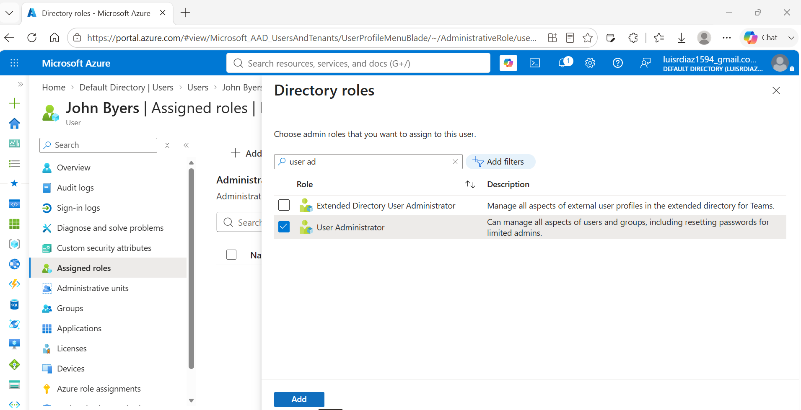
*User Administrator role assigned to John Byers*

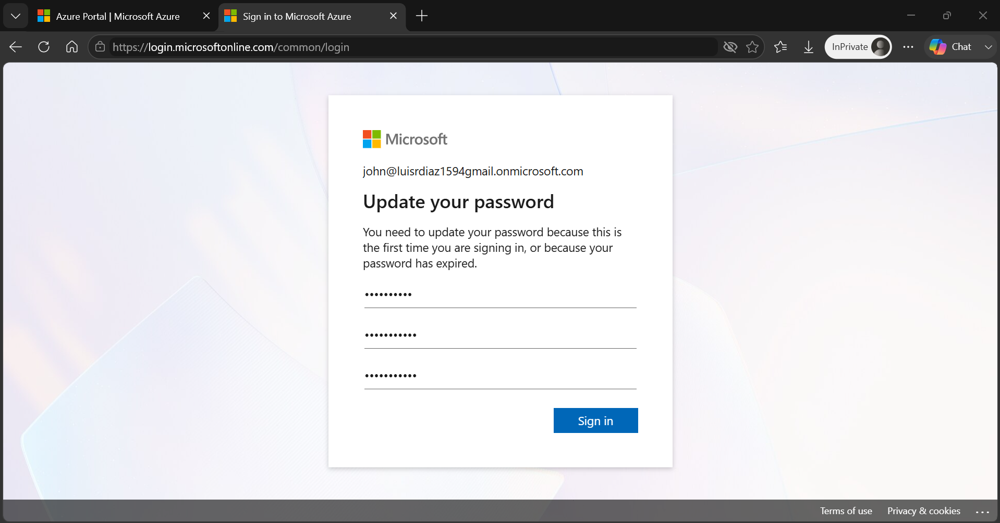
*Forced password update prompt on John Byers' first sign-in*

---

### 🟦 Task 2 — Building Role-Based Groups with Dynamic Membership

**Scenario:** Rather than manually assigning users to groups, I built two security groups that automatically populate their membership based on a user's `jobTitle` attribute — removing manual provisioning steps as headcount grows.

**Actions Taken:**
1. Created security group **IT Cloud Administrator** with **Dynamic User** membership
2. Configured the dynamic query rule: `(user.jobTitle -eq "Cloud Admin")`
3. Confirmed the group was created successfully
4. Repeated the process for a second group, **IT System Administrator**
5. Configured its dynamic query rule: `(user.jobTitle -eq "System Administrator")`
6. Confirmed the second group was created successfully

**Principle Applied:** Attribute-based dynamic membership — access follows the job title automatically, so onboarding a new Cloud Admin or System Administrator no longer requires a manual group-add step.

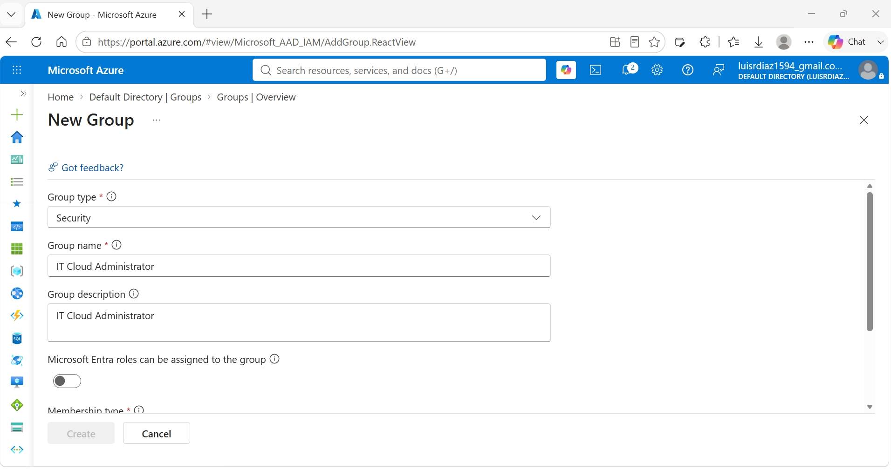
*Creating the IT Cloud Administrator security group*

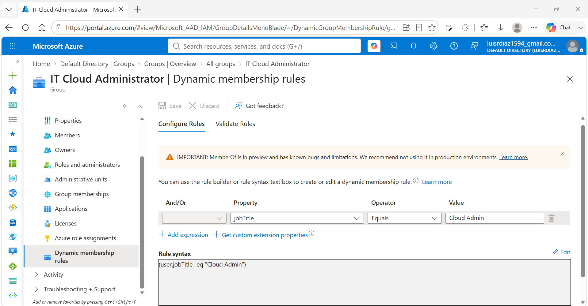
*Dynamic membership rule: jobTitle equals "Cloud Admin"*

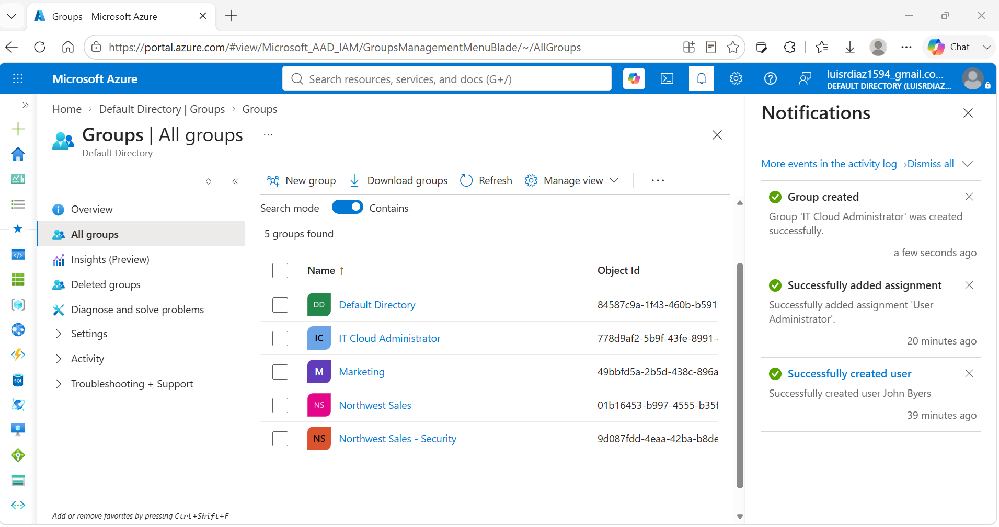
*IT Cloud Administrator group created successfully*

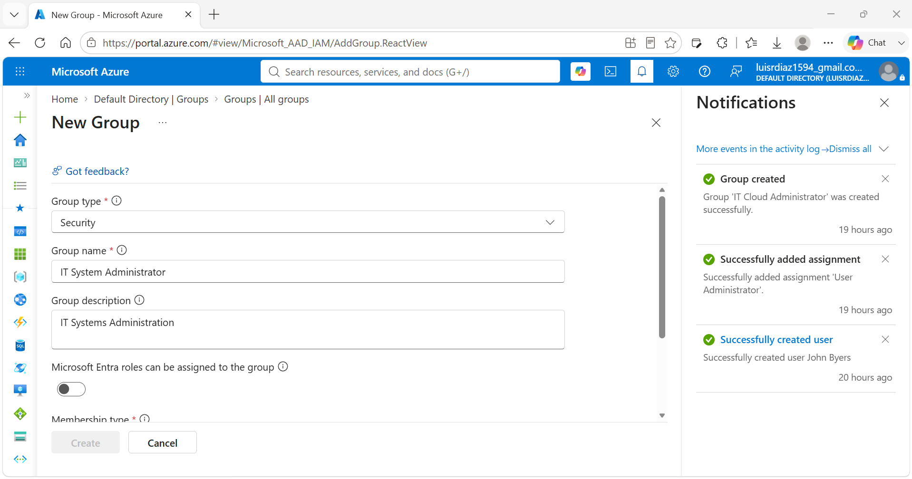
*Creating the IT System Administrator security group*

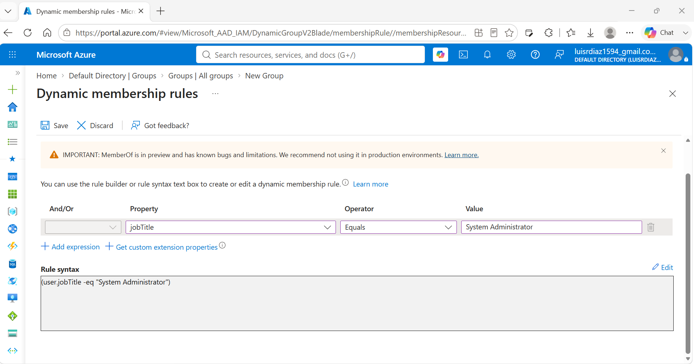
*Dynamic membership rule: jobTitle equals "System Administrator"*

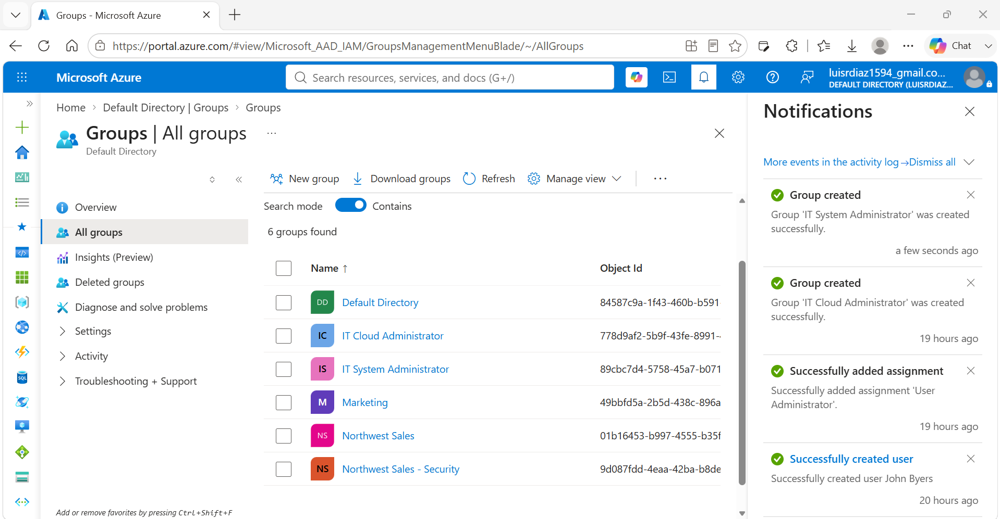
*IT System Administrator group created successfully*

---

### 🟩 Task 3 — Nesting Groups for Tiered Access (IT Lab Administrator)

**Scenario:** To grant a single "umbrella" tier of lab-wide access without duplicating individual user assignments, I nested the two role-based groups inside a third, higher-level group.

**Actions Taken:**
1. Created a new security group: **IT Lab Administrator** (Assigned membership type)
2. Added **IT Cloud Administrator** and **IT System Administrator** as *group members* of IT Lab Administrator (group nesting)
3. Confirmed IT Lab Administrator's direct members — both nested groups appear correctly
4. Drilled into IT System Administrator to confirm its own dynamic membership (Brian Rodgers) flows through the nesting
5. Drilled into IT Cloud Administrator to confirm its own dynamic membership (John Byers) flows through the nesting

**Principle Applied:** Group nesting for tiered RBAC — any resource permission granted to IT Lab Administrator automatically extends to every member of both nested dynamic groups, without re-provisioning individual users.

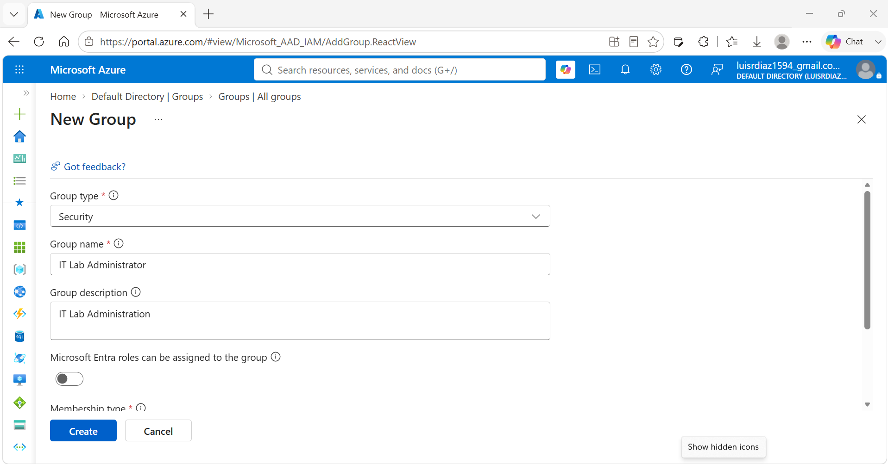
*Creating the IT Lab Administrator security group*

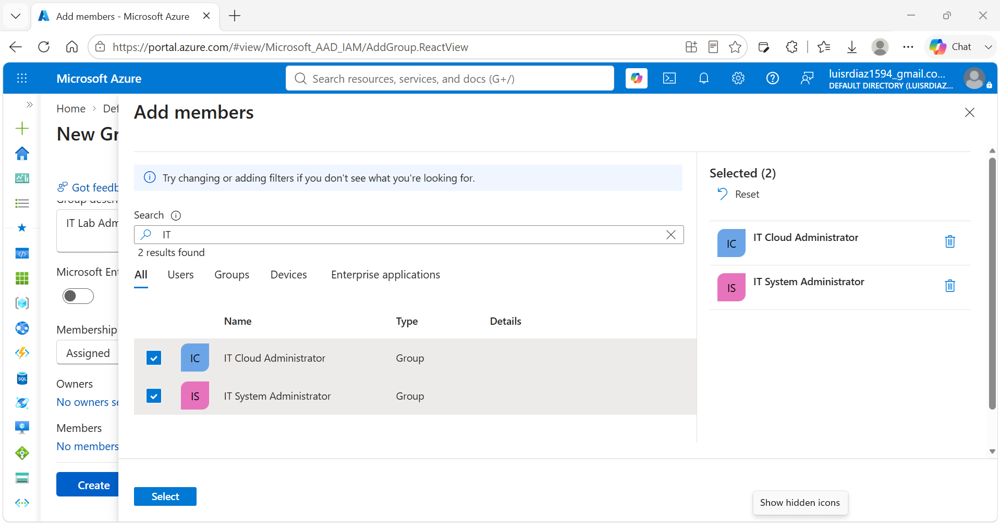
*Adding IT Cloud Administrator and IT System Administrator as members of IT Lab Administrator*

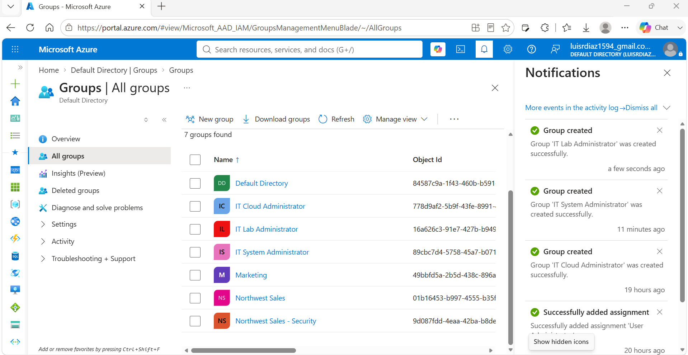
*IT Lab Administrator group created successfully*

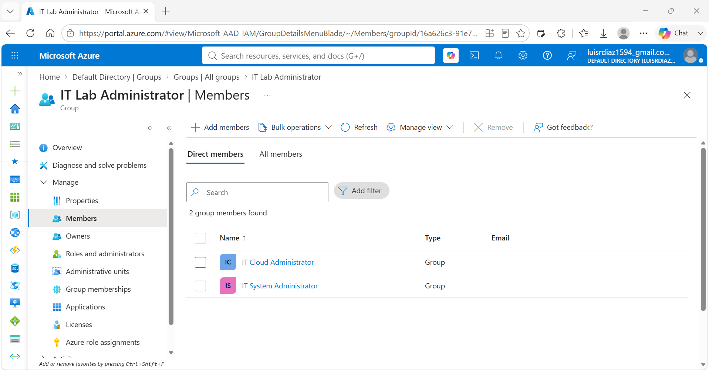
*Direct members of IT Lab Administrator: IT Cloud Administrator and IT System Administrator*

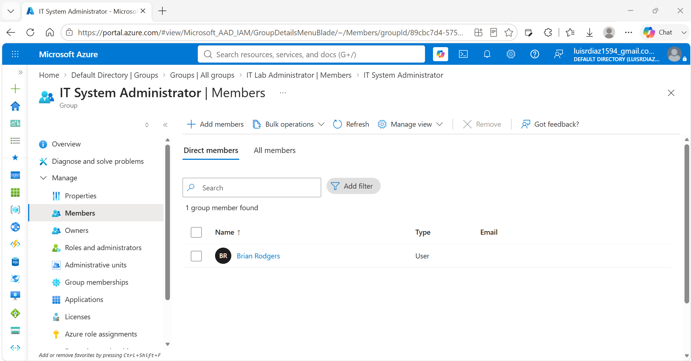
*IT System Administrator's own membership (Brian Rodgers) confirmed within the nested structure*

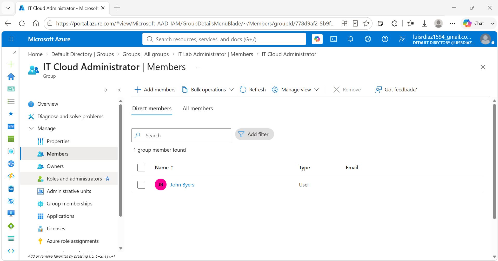
*IT Cloud Administrator's own membership (John Byers) confirmed within the nested structure*

---

### 🌐 Task 4 — Inviting an External (Guest) User

**Scenario:** The tenant needed to collaborate with an external partner without creating a standard Member account for them, so a guest invitation was used instead.

**Actions Taken:**
1. Navigated to **Users → Invite external user**
2. Entered the external email address and display name
3. Reviewed the auto-generated invite redirect URL and invite message
4. Sent the invitation
5. Confirmed the invite succeeded — the user appears in the directory as **User type: Guest**

**Principle Applied:** External identity separation — guest accounts are visually and functionally distinct (`User type: Guest`, `#EXT#` UPN suffix) from internal Member accounts, keeping external collaborators scoped and auditable.

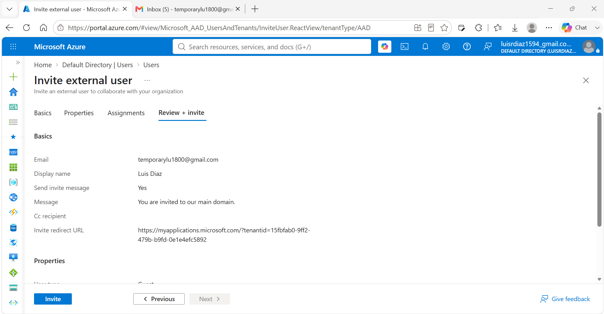
*Reviewing and sending the external user invitation*

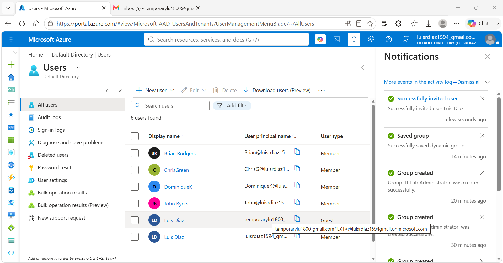
*Guest user appears in the directory with User type: Guest*

---

## Skills Demonstrated

| Skill | How It Was Applied |
|-------|--------------------|
| Role-Based Access Control (RBAC) | Assigned the User Administrator directory role to a specific user |
| Secure Credential Practices | Enforced a mandatory password change on first sign-in |
| Dynamic Group Membership | Built two groups that auto-populate membership from the `jobTitle` attribute |
| Group Nesting | Nested two dynamic groups inside a parent group for tiered access |
| Guest User Management | Invited and confirmed an external identity as a Guest account |
| Documentation | Structured, evidence-based write-up with a screenshot for every step |

---

## Lessons Learned

**Dynamic groups remove a manual step, but the rule syntax has to be exact.** The `jobTitle -eq "..."` rule only matches an exact string, so a mismatched job title on a user profile means silent non-membership — worth double-checking the attribute value on the user object, not just the rule itself.

**Nested groups make tiered access much easier to reason about.** Instead of assigning IT Lab Administrator access to individual users one at a time, nesting IT Cloud Administrator and IT System Administrator inside it means any future access granted to the parent group automatically applies to both role populations — and new Cloud Admins or System Administrators inherit it the moment their job title matches.

**Guest accounts are a distinct identity type, not a permission level.** The `User type: Guest` and `#EXT#` naming pattern make external identities easy to spot in the directory at a glance, which matters for access reviews and audit readiness.

---

## References

- [Microsoft Entra ID Documentation](https://learn.microsoft.com/en-us/entra/identity/)
- [AZ-104 Lab 01 – Manage Microsoft Entra ID Identities](https://github.com/MicrosoftLearning/AZ-104-MicrosoftAzureAdministrator/blob/master/Instructions/Labs/LAB_01-Manage_Entra_ID_Identities.md)
- [Dynamic Membership Rules for Groups](https://learn.microsoft.com/en-us/entra/identity/users/groups-dynamic-membership)
